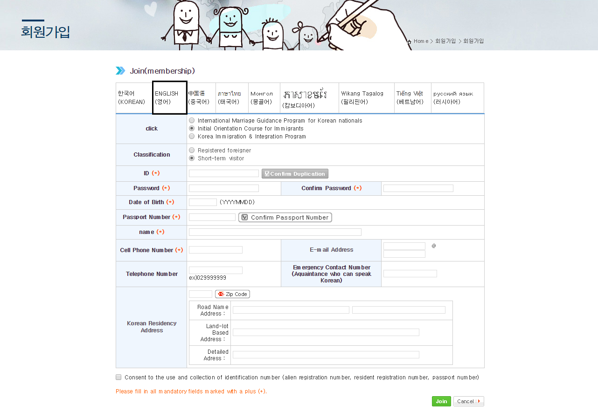

# Social Integration Programs 

Social Integration Programs, are different programs offered by the Korean government (or different cities) for foreigners living in Korea. Each program is different, but usually, provides Korean language and Korean culture lessons.

**The main three programs are:**
1. Korea Immigration & Integration Program (KIIP)
2. Initial Orientation Course for Immigrants 
3. International Marriage guidance Program (available for both Koreans & Non-Koreans)

Each program has few levels: from basic to advance, while each level usually takes 2~3 months to complete.
When applying, you will take a test to determine the level you will join.
Note that there are different registration periods, based on the program you choose. 

### Benefits
Different programs have different benefits, however, they are similar.
Here are the benefits for the KIIP (the most popular program):

**Naturalization (becoming a Korean citizen)**
- Comprehensive Assessment step: Acceptance (pass)
- Exemption of the interview step
- Reducing the time of the process
**Permanent residence:**
- Exempt from taking TOPIK
- Exempt from 'current status' evaluation 
**Other types of residency:**
- Bonus points for the application
- Exempt from taking TOPIK
**Application to any visa status:**
- Exempt from taking TOPIK

### Applying for Programs
In order to apply, you can go to: www.socinet.go.kr 
Or through your city official website.
As sits are filled quickly, you can see the schedule and prepare in advance 

On the website:

1. To apply for a program you will first need to signup or login as a member 

2. Choose the language and fill the details as below:

::: tip NOTE
- Once you are a member you can decide to which program you want to apply.
- The application for the programs  is usually in Korean, with a manual explaining how to register.
:::