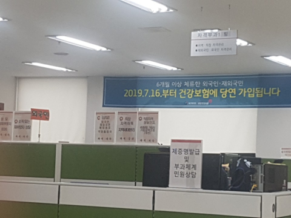

# Mandatory National Health Insurance to all Non- Koreans as of July 2019

As of **16, July 2019** all foreign residents staying in Korea for 6 months or more must enroll  to the National Health Insurance.

**Company Employees**- Are covered by the company

**International Students enrolled in degree programs**- Will be covered from the day of registration (ARC) by the state insurance plan. (Note that D-2 and D-4 students may not be eligible for the NHI)

**Marriage Immigrants**- Will be covered from the day of registration (ARC) by the state insurance plan.

**Others** (Freelancers, Language school students etc.)- Need to enroll to the NHI separately .

The payment amount (if not covered under employer):

General: Around 110,000 won / per month 

Students (degree programs): 56,530 won/ per month

Permanent residents and Married residents: Payment  will be adjusted based on financial status. (if financial status can not be proved will pay the general fees)

- If you have insurance from your home country, you may apply for exemption.
- Any delayed payment or failure to pay may lead to disadvantage when extending or changing visa status or in re-entry to the country 

By revising the law, the government makes sure that foreigners staying in Korea will receive the same medical services and benefits as Koreans 

You can see this notification in NHI offices:

