# "How to" - Booking Express Bus Tickets 

If you are planning a trip inside Korea, and considering taking the bus, you don't have to go to the terminal in order to buy your ticket. You can easily do it through Kobus [website](https://www.kobus.co.kr/main.do) (or app, but it is only in Korean) as follow:

Go to the website and choose the language you want (this explanation is for English)

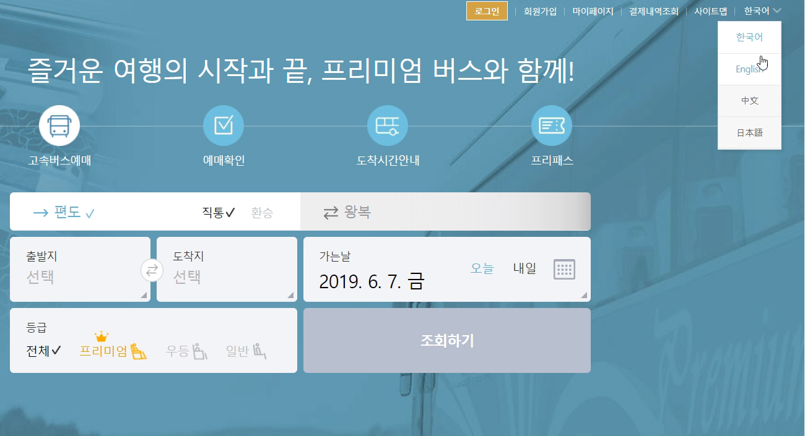

You can start your booking from the main page:

Select your trip details (locations, date and bus type) as below:

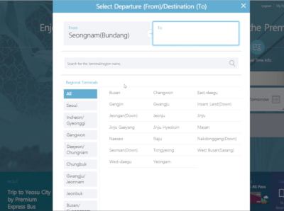

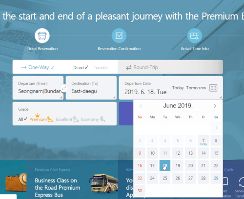

Read and agree to the cancellation terms. it is recommended to read it and not just agree as you might need to cancel your ticket later on, so this way you will know what to do/ pay if you cancel.

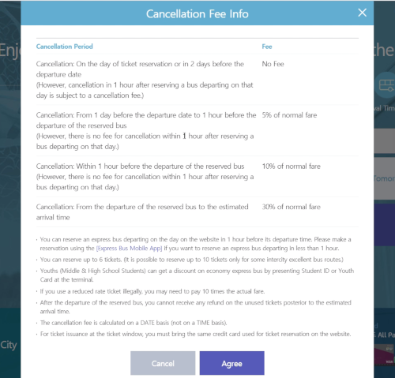

Next you will see the schedule and bus type to choose from. On the side menu, you can see the different prices of the different bus types. 

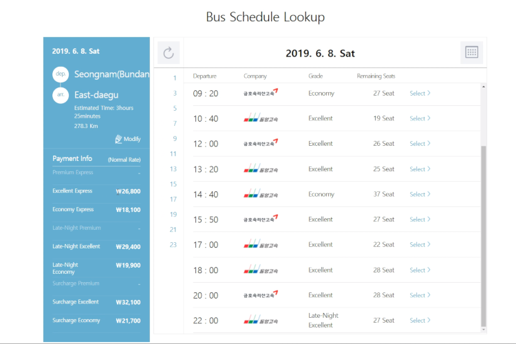

After you select the time, you need to select your seat. Here you will be able to choose the number of passengers and their age group. The seats marked in gray are taken seats. you can choose from the seats in white. after you choose your seat, you will also see the final price for your booking.

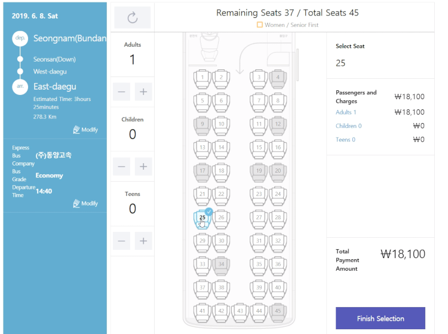

Now, it is time for the payment. if you are a member, and logged in, it will take you directly to the payment screen if not, you have the option to buy the ticket as non- member as below:

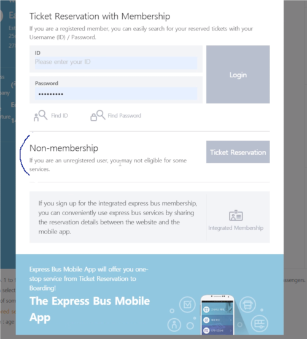

The next step is to agree to the Terms of Use and create a one time password for your purchase. With this password you can make changes and cancel the ticket if needed.

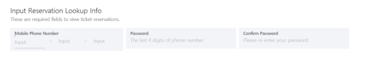

Now, the final stage, you can make the payment. Input your payment method and information. Notice that this service **does not** support all types of international cards.

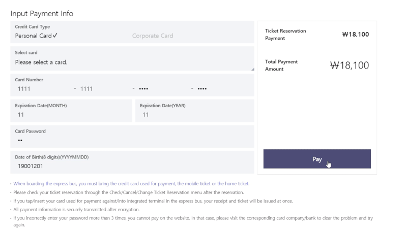

After you press "Pay" it will process the payment, once completed you are done!

We also recommend you to download the app, this way, you do not need to print the ticket, but will get a bar-code to use when going on the bus. so it is easy and quick!
The app is all in Korean but intuitive to use, even if you do not understand Korean

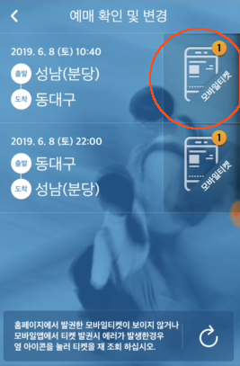

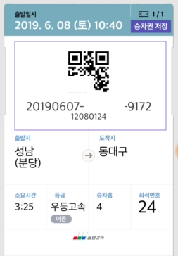

And you are done! 
We hope you have a nice trip!