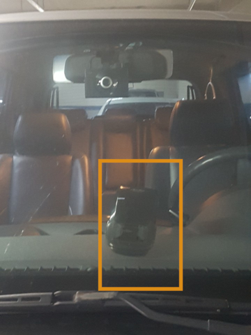
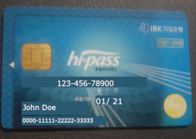

# Hi-Pass Card for Your Car 

If you are looking to have an Hi- Pass Card for your car, there are a few things to know:

**On Board Unit (OBU)**

In some cadrs, you will need this unit in order to use your Hi-Pass card, and you should install it on the inner side of your front windshield, in order for it to work properly.
You may get the OBU in few ways:

- Hi-Pass order online
- Online shopping malls 
- Highway rest stops (most of them)
- Gas stations and Car repair shops

Install the OBU as below:

**Hi-Pass Card**

You will be able to pay the monthly billings by connecting your Hi- Pass to your bank account.
Another way is to charge in recharge your card as you like. just remember to charge enough fees for your ride.

You may get the card in similar places as the OBU:

Hi-Pass order online
Online shopping malls 
Most of the highway stops
Gas stations and Car repair shops

Hi- Pass card:

**Official website** (available only in Korean): https://www.extoll.co.kr/main.do

**Customer service center** (available only in Korean): 1588-2504 press 3 for Hi-Pass 