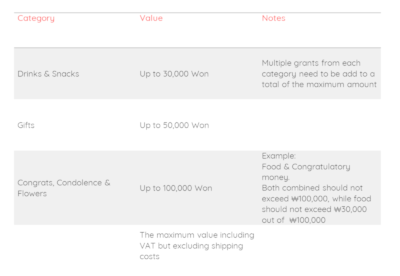

# Anti-Bribery and Graft Act Details 

In late 2016 (after 4 years process), the anti- bribery and graft act, also known as Kim Young-Ran act, was approved.
It is called after its initiator ( Young Ran Kim,  who was Head of ACRC: Anti corruption and Civil Rights Commission),
and its main purpose is to prevent corruption among government officials and civil servants.

As before the law restrictions were quite flexible, with not much control, which created easier ground for bribing government officials.
The law basically limits the amount value of a gift one can give to civil servant. However it has been implemented by companies as well, not only related to government work, but generally.

You can benchmark the below table, which presents the principles of the act:

Those who will brake the law are responsible, from both sides, and expected to be punished as follow:
- Civil servant who excepted a gift higher in value might pay a fine, get a warning, or if the value is more than 1,000,000 won the punishment is up to 3 years in jail
- Employee & company who sent illegal gift will be punished by law. usually, sort of payment of fine. 
However, a company can show it had no connection to the gift by providing evidence, that it has a system to prevent illegal gift giving. In that case, the employee might pay a fine, or warning (depend on different factors) 

Now that you know about this act, be conscious about the gifts you give and get, especially when working with government officials.

You can see more detailed explanation in [this video]()

::: tip NOTE
There is no official document of the law in English,
But if you want to search official information (in Korean), you can go to:

**Official Website**: http://www.law.go.kr
 
**Direct Link**: Click [here](http://www.law.go.kr/lsInfoP.do?lsiSeq=183553&efYd=20161130#0000)
:::