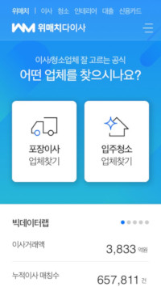

# Moving Services Platform- Korean 

If you are looking to use moving services and can speak and write Korean,
There is a platform (web & app) that allows you to input your moving information, and get suggestions of moving users rated companies.

You can also see detailed reviews of the companies, and other users experiences with the move.

After inputting your information, you will receive calls from the different companies and you can compare the prices.

::: tip
take photos of the things you need to move and wrap, and send it to the companies. That way you can get the right evaluation to your luggage, with less misunderstandings
:::

- Name: 다이사 (daisa)
- Website: http://da24.wematch.com  
- App: 다이사

