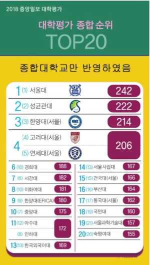

# 2019 Top Ranked Universities 

In fall 2018,  Joonang ilbo (중앙일보), media company, mainly operates its newspaper, have released the past year's universities ranking.

This has been a ranking that the paper is doing ever since 2010, and highly considered as it started the trend in Korea. They publish the list every year at fall.

This is a general university ranking, and not specific by subject or degree type. They take under consideration many different categories when ranking. from professors, curriculum, publishing, student registration and much more.

Here is the latest ranking from 2018:

### The Top 10:
1. Seoul National University (SNU)
2. Sungkyunkwan University (SKKU)
3. Hanyang University- Seoul Campus
4. Korea University and  
5. Yonsei University 
6. Kyung Hee University
7. Sogang University
8. Ewha Womans University
9. Hanyang University- ERICA Campus
10. Chung Ang University 

As there are official rankings, there is still a strong social ranking started decades ago, and still playing a strong part in society. Whether student applications number, strong alumni or when applying for jobs, still this social ranking has strong influence.

::: tip NOTE
The traditional top 3 universities are: Seoul National Uni., Korea Uni., Yonsei Uni., together called **SKY**. 
Those considered as top tier universities and competition to get in and between universities is fierce.
:::

Pohang University (POSTECH) and Korea Advanced Institute of Science & Technology (KAIST) are also considered top universities.