# How to Issue/ Reissue Digital Certificate (공인인증서) 

### What is a Digital Certificate? 
The Digital Certificate is a type of digital identification of individuals or companies in Korea, and it acts as another layer of security when doing online actions.
Every Digital Certificate is personal only to specific person (or company) and it has a validation date of 1 year, so each year there is a need to reissue a new Digital Certificate.

::: tip
There are different cases we need a Digital Certificate, it can be for Online Banking, Tax Reports and Tax refund, Year End reports and more.
:::

**Where can it be issued?**
You can issue the Digital Certificate online, through your bank website. (it is also possible to issue it in the bank itself)

### How to issue the Digital certificate?

Before you issue your certificate, you need to have the following:
- Alien Registration Number
- Online Banking ID
- OTP (or digital OTP)

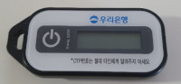
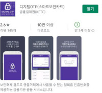

**The Process (Online)**: 
- Some banks do not support this process in English, so this is a guide on the Korean version, with explanations. The  English version, is the same.
- The explanation done by using Woori Bank, but it is similar to all banks.

1. Go to your bank website and choose 공인인증센터 > 개인공인인증센터 (Digital Certificate Center > Personal)

2. Choose 공인인증서 발급/ 제발급 (Digital Certificate Issue/ Reissue)

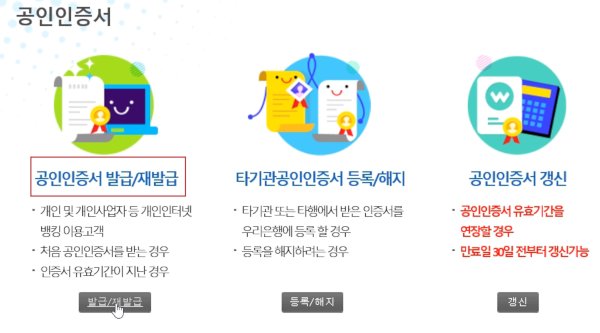

3. Select the type of certificate you want to issue:
The basic certificate is free and allows you to use it for: internet banking, credit card payments, insurance and for "hometax" services.
- Look for the words: 은행, 신용카드 ( bank, credit card)
 
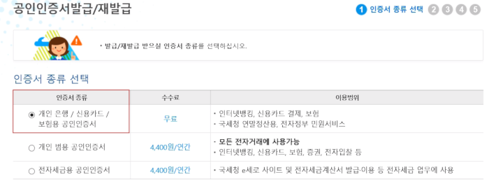

4. Agree to the terms and conditions

5. Fill your banking ID & your alien registration number

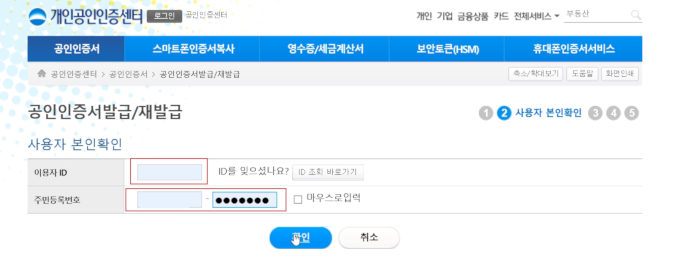

6. Fill the number code you receive from your OTP (or digital OTP) 

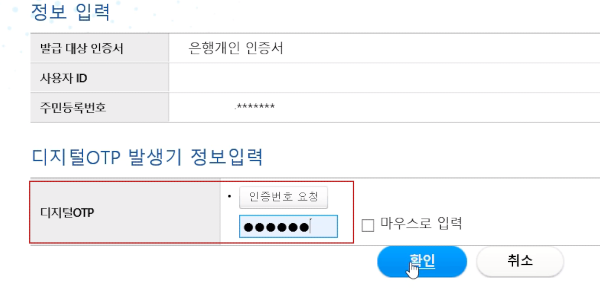

7. Fill your personal Information such as bank account number, password, address and cell phone number.
In some cases, if you do not have the information needed, you can mark "해당 사항 없음" (means: not specified)

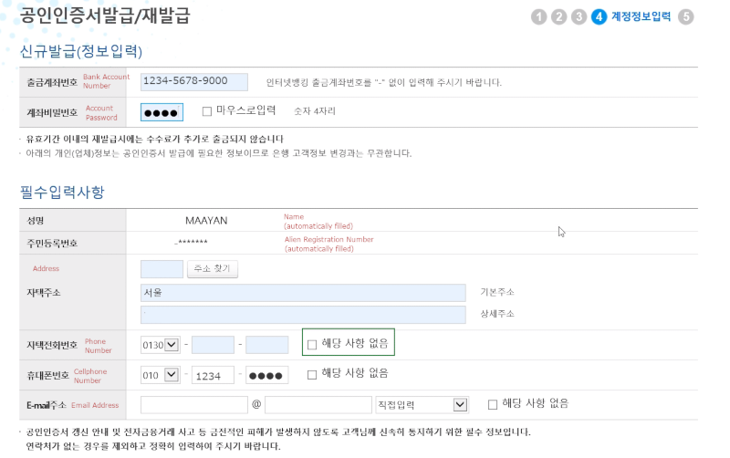

8. Now, you will receive a message explaining the digital certificate process, once you approved you need to choose the place to save your Certificate. You can save it on your hard-disk, USB or browser. 
- I recommend to save it on your computer/ laptop hard-disk so it will be available at all times.

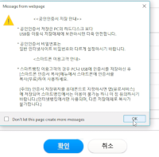 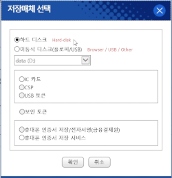

9. Create a password for your Digital Certificate 
The password should comply with specific rules, usually those are using: Caps letters, small letters, numbers and special characters.

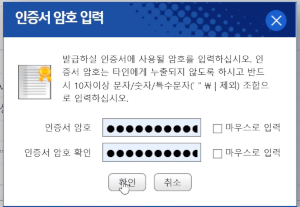

**You are done!**
Now you can use your Digital certificate for different actions online.

When you will use it, it will come up from the place that you saved it automatically

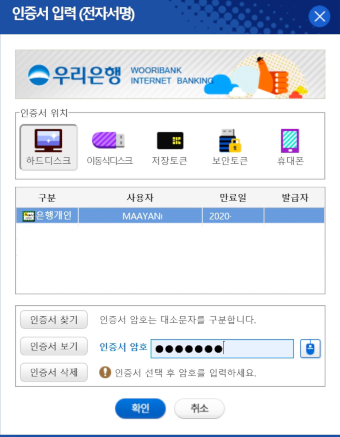