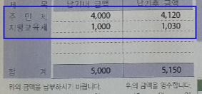
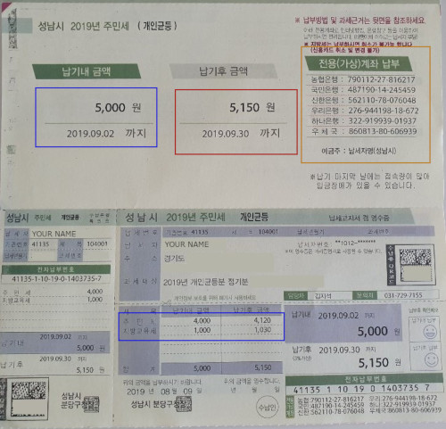

# Things Good to Know About Residence Tax(주민세) 

Every year in August, the local tax offices send payment slips for Residence Tax (주민세- Juminse).
There are Privet Residence Tax (개인균등) and Company Residence Tax (법인균등분),  here we will focus on the private tax.

**Who pays this tax?**
- Non Koreans who are residing in Korea more than 1 year
- People who are not under company insurance such as: freelancers, hourly based workers, non- employed, etc.
- Who is over 20 years old and under 65 years old

**What is included?**
- Residency tax payment (주민세)
- Local education tax payment (지방교육세 )

**How much is the payment?**
- The payment of this tax is different between people, mainly based on income.
- The minimum is 5,000 won
- Usually under 10,000 won (including everything)

**How to pay?**

In the BLUE top square is the amount you need to pay by the due date.
In the RED square is the amount you will pay after the due date
In the ORANGE square is your allocated bank account to deposit the payment

You can make a bank transfer, deposit cash through ATM/ Bank, or pay with credit card by phone.

::: tip
- Try to pay by the 2 deadlines, if not this amount will keep collecting interest
- If you do not pay this tax you might have limitation on tax (such as not receiving year end tax)
:::

