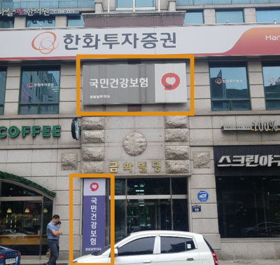

# National Health Insurance- Contact Information 

The National Health Insurance System, NHIS has also support for foreigners.
It is good to know though, that the majority of the actions,  foreigners can still NOT do online, and supported only in the offices (that is in case you are handling the NHI directly and not as a company employee).

Below the differnt contacts of NHI services:
- Main Website: http://www.nhis.or.kr
- English Website: Clink this [link](https://www.nhis.or.kr/static/html/wbd/g/a/wbdga0101.html)
- English Call Center: 1577-1000 (press 7)  or  033-811-2000  for English consulting

Also, you can find the nearest office on the website.

You can look for the below sign when going to the NHI office

