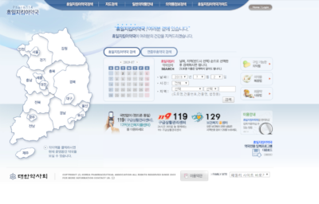
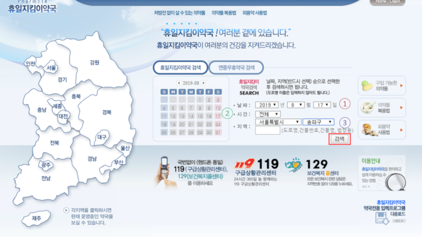
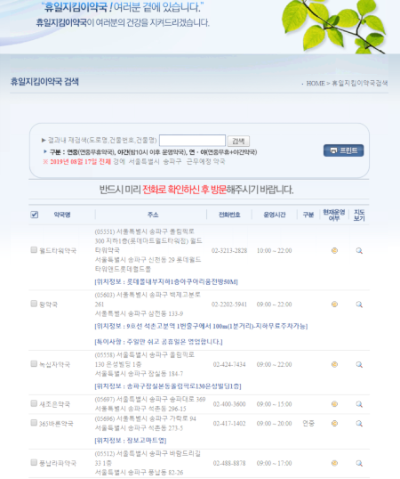
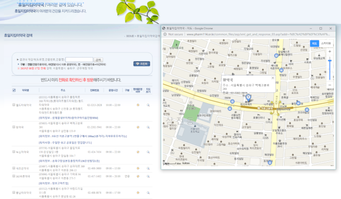

# Online Search for Pharmacies 

Sometimes, we need a pharmacy and not a hospital but not sure where and how to find it.
Other times, the hospitals are closed but pharmacies are open, and can help handle some basic situation we experience.

We can always look for a pharmacy on the street (as there are many indeed), but not all of them are always open.
So what can we do? we can search online!

Although it is all in Korean, it demands basic level of reading and writing to use. Here is how to use it:

1. Go to the **website**: http://www.pharm114.or.kr
2. You will see your search screen with that day's date: this is the **main page**

3. Input the **information** you want:

 - Date 
 - Specific time (or leave "All" asdefault)
 - City (and area in the city)
 - Hit the search button 

4. **results**

You will see a list with the results you looked for, the details given are: pharmacy address, phone, operating times, if it is open now (if yes- will be green dot, if no, will be yellow or red) and the possibility to  see a map

::: tip
You can take the map screen shot and show it to Koreans if you are not sure what it says
:::