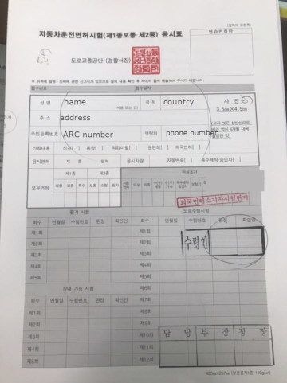
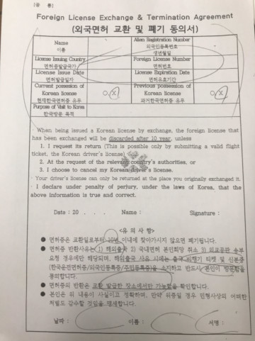
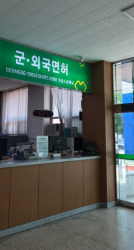
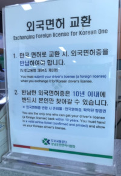

# Exchanging License Process 

There are two options to drive with a local license in Korea, one is to issue a license and the other is to exchange your original license with Korean license. 

We will discuss the process for exchanging your license:

**First step**: Check if your origin country license is available to exchange in this [link](http://dl.koroad.or.kr/license/en/sub/popInterLicArea.jsp)

**Second step**: prepare the necessary documents
- Original foreign license
- Original passport (passport with stamps confirming entry & departure)
- Original Foreigner Registration Card 
- 3 Color photos taken within 6 months (standard size 3.5 cm x 4.5 cm)
- Embassy certificate of license or Apostille
- Certificate of the Facts Concerning the Entry & Exit (if not shown in the passport)

::: tip NOTE
Some countries embassies are not providing the documents, only in the origin country, you need to confirm it with your embassy.
:::

**Fees to prepare**:
- Health check (eye check): KRW 6,000: if you have a valid eye test results (done in Korea) from the past 2 years, you do not need to take the test again
- Processing fees: KRW 7,500

**Third Step**: go to a KOROAD office to exchange your license 
You can check the offices locations, in this [link](http://dl.koroad.or.kr/license/en/sub/dlExamOffice.jsp)

**Forth step**: Fill a form and submit it with your license

And sign an exchange license agreement: 

**Finally** go to the exchange booth, submit the documents, and pay the fees

::: tip NOTE
- When you exchange your license, you give away your origin country license to deposit.
- When you need your license back, you need to exchange it again in return for your Korean license ( you must show a flight ticket to do so)
:::

**KOROAD Information**:
KoROAD website: http://www.koroad.or.kr/en_web/index.do 
Licence application process: http://dl.koroad.or.kr/license/en/sub/application.jsp 
License related preparations: http://dl.koroad.or.kr/license/en/sub/guidance.jsp

