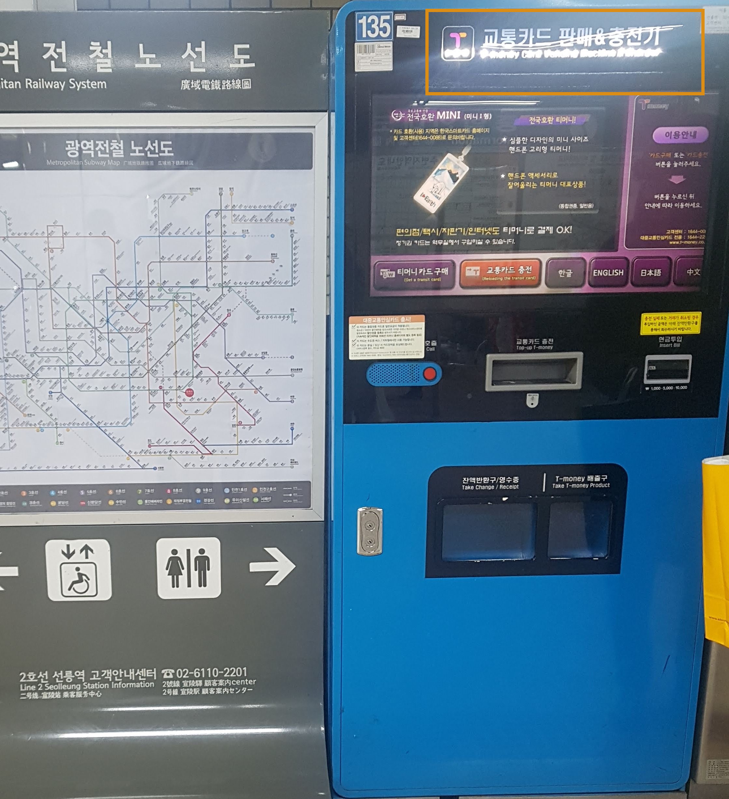

# Transportation Card Companies 

There are few different transportation card options, but the main two operators are T-Money and Cashbee.

These cards are used to pay for transportation such as the bus, subway and taxi.
They are also excepted in many other businesses such as continence stores, coffee shops, cosmetic shops and much more.

These card can also have benefits such as discounts and special events.

The cards you can purchase at the airport, convenient stores, designated machines, or online. 

The card cost is a deposit fees (returnable after you return the card), usually 2,500 won. while some designed cards cost around 5,000 won (you will only get 2,500 back).

After you get the card you can recharge (top-up) it with the amount you want in convenience stores, subway stations, or through the card company online.

Below is a sample of designated machine at the subway to purchase or top-up your transport card.

Transportation card companies information: 

**T-money:** 
- English [Website](https://www.t-money.co.kr/ncs/pct/tmnyintd/ReadFrgnKoreaTourCardEngIntd.dev)
- Foreign Language Call Center- 1644-0088 Press *8 
- Working Hours: Mon~ Fri, 9:00~ 18:00

**Cashbee:**
- English [Website](https://www.cashbee.co.kr/cb/service/FrgrUsGudEn.do)
- Call Center (only in Korean)- 1644-0006
- Working Hours: Mon~ Fri, 9:00~ 18:00
